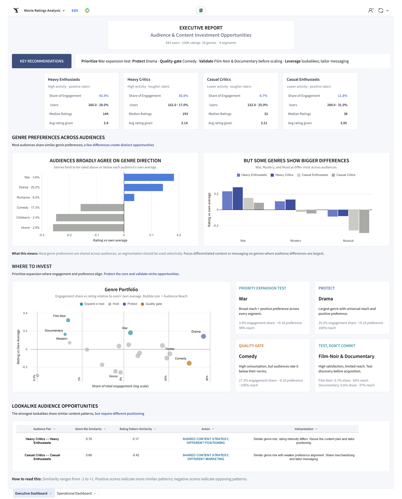
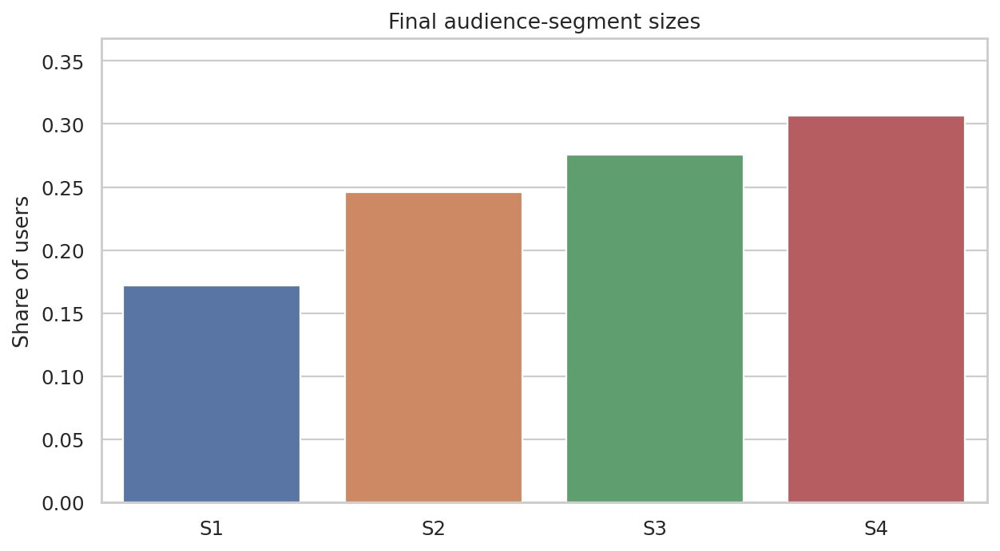

<div align="center">


# Streaming Audience Segmentation & Content Strategy

**Behavioral segmentation, genre affinity, and decision-support analytics built with Python and Sigma Computing.**

[](https://app.sigmacomputing.com/embed/1-4cWABwP9eILTt9KRblVwJB)
[](https://app.sigmacomputing.com/embed/1-5p0Kl4xjp6MZzwiTTvXwcP)


</div>

<p align="center">
  
</p>

<p align="center"><sub><strong>Executive view:</strong> audience profiles, genre opportunities, and lookalike strategy.</sub></p>

## Project at a glance

Using the MovieLens 100K dataset, I modeled a streaming-platform analytics problem: **who the audiences are, what content resonates with them, and where segmentation actually changes a business decision**.

I built an end-to-end analytics workflow that:

- segmented **943 users** from **100,000 ratings** into four stable behavioral audiences;
- measured genre affinity using **scale, lift, relative preference, and support** rather than a single opaque score;
- identified lookalike audience pairs with similar content patterns;
- translated the analysis into separate **executive** and **operational** Sigma dashboards;
- packaged the workflow as a reproducible Python pipeline with validation at each stage.

| Users | Ratings | Genres analyzed | Final segments |
|:---:|:---:|:---:|:---:|
| **943** | **100K** | **18** | **4** |

## What the analysis surfaced

| Decision | Evidence | Business implication |
|---|---|---|
| **Test War expansion** | 3.6% engagement share, **+0.18** rating vs. users' own average, 98% reach | Broad enough to test, with consistently positive preference |
| **Protect Drama** | **25.2%** of engagement, +0.14 relative preference, 100% reach | Core category with both scale and positive response |
| **Quality-gate Comedy** | 17.3% of engagement but **-0.16** relative preference | High consumption does not automatically mean high satisfaction |
| **Validate Film-Noir & Documentary** | Strong relative preference but limited reach | Treat as discovery / niche tests before scaling |

The larger takeaway: **most audiences agree on broad genre direction; segmentation is most useful where the differences are large enough to change content or messaging decisions.**

## Audience segments

| Segment | Share | Median ratings | Avg. rating | Behavioral read |
|---|---:|---:|---:|---|
| **Heavy Critics** | 17.2% | 193 | 3.14 | High activity, tougher raters |
| **Casual Critics** | 24.6% | 32 | 3.21 | Lower activity, tougher raters |
| **Heavy Enthusiasts** | 27.6% | 144 | 3.80 | High activity, positive raters |
| **Casual Enthusiasts** | 30.6% | 38 | 3.95 | Lower activity, positive raters |

<p align="center">
  
</p>

## How I approached the problem

```text
MovieLens 100K
      │
      ▼
Data audit & cleaning
      │
      ▼
User-level behavioral features
      │
      ▼
60 segmentation experiments
      │
      ▼
Whole-user stability validation
      │
      ▼
4 behavioral audience segments
      │
      ├── Genre affinity
      ├── Lookalike similarity
      └── Boundary / outlier diagnostics
               │
               ▼
      Executive + Operational dashboards
```

The final clustering model is intentionally simple: **log rating activity + mean user rating**. Broader feature sets were tested, but genre shares were more useful as a post-clustering explanatory layer than as inputs to the distance function.

**Why K=4?** K=3 had the stronger silhouette, but K=4 retained very strong whole-user fold stability (reference ARI ≈ **0.95**) and created a decision-relevant split between high-activity critical and positive raters. The tradeoff is documented rather than hidden.

→ [Read the methodology](docs/methodology.md)  
→ [Open the executed analysis notebook](notebooks/audience_segmentation_analysis.ipynb)

## Executive vs. operational reporting

The two dashboards are intentionally different:

**Executive dashboard** - curated, decision-oriented, no filters. It focuses on audience profiles, content investment, where segments differ, and lookalike opportunities.

**Operational dashboard** - exploratory. It adds genre-by-segment diagnostics, opportunity gaps, boundary thresholds, outlier review, and user-level drill-down.

<p align="center">
  
</p>

<p align="center"><sub><strong>Operational view:</strong> segment controls, boundary thresholds, demographic filters, outlier diagnostics, and user-level review.</sub></p>

→ [Read the dashboard design rationale](docs/dashboard-design.md)

## Lookalike audiences

The strongest content-pattern lookalikes were:

- **Heavy Critics ↔ Heavy Enthusiasts** - genre-mix cosine similarity **0.78**
- **Casual Critics ↔ Casual Enthusiasts** - genre-mix cosine similarity **0.68**

These pairs can potentially share parts of a content strategy, but their different rating behavior means positioning should remain distinct. Similarity is descriptive, not evidence of campaign transfer.

## Repository guide

```text
streaming-audience-analytics/
├── README.md
├── run_pipeline.py
├── requirements.txt
├── assets/                       # Dashboard + analytical visuals
├── notebooks/
│   └── audience_segmentation_analysis.ipynb
├── src/                          # Reusable analysis modules
│   ├── data_prep.py
│   ├── feature_engineering.py
│   ├── segmentation.py
│   ├── affinity.py
│   ├── reporting.py
│   └── validation.py
├── docs/
│   ├── methodology.md
│   └── dashboard-design.md
└── data/
    ├── README.md
    └── raw/ml-100k/              # Dataset placed here locally
```

## Reproduce locally

```bash
git clone https://github.com/karanpandya30/streaming-audience-analytics.git
cd streaming-audience-analytics
python -m pip install -r requirements.txt
```

Download **[MovieLens 100K](https://grouplens.org/datasets/movielens/100k/)** from GroupLens and place `u.data`, `u.item`, `u.user`, `u.genre`, and `u.info` in `data/raw/ml-100k/`, then run:

```bash
python run_pipeline.py
```

The pipeline creates processed data, model outputs, dashboard-ready exports, figures, and validation reports.

## Important limitations

- MovieLens contains ratings, not verified streams, impressions, completion, or watch time.
- Ratings are therefore used as a **proxy for engagement**.
- Segment labels describe observed behavior, not motivation or identity.
- Content and targeting recommendations are **testable hypotheses**, not causal claims.

## Data source

This project uses the **MovieLens 100K** dataset from GroupLens Research. Raw MovieLens files are intentionally **not included in this repository** because the dataset's supplied usage terms state that redistribution requires separate permission. Review the original GroupLens usage terms before downloading or using the dataset.

> F. Maxwell Harper and Joseph A. Konstan. *The MovieLens Datasets: History and Context.* ACM TiiS, 2015.

---

<div align="center">
Built by <strong>Karan Pandya</strong> · Data & BI Analytics
</div>
