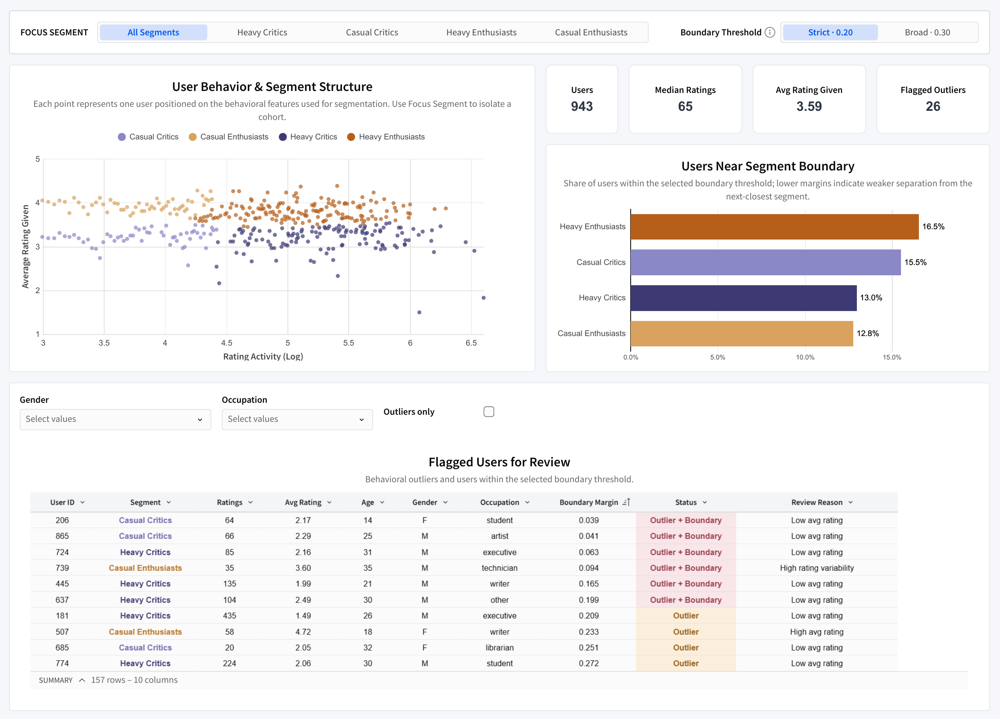

# Dashboard design

The project uses two reporting layers because executive and analyst questions are different.

## Executive dashboard

Designed to answer four questions quickly:

1. Who are the key audience groups and how do their activity and rating behaviors differ?
2. Where should content investment be prioritized based on scale and relative preference?
3. Where does segmentation actually change a decision, and where do audiences broadly agree?
4. Which audiences have similar enough content patterns to share strategy, while still requiring different positioning?

### Design choices

- **No filters on the executive view.** It is a curated comparison, not an exploration workspace.
- **Always show scale next to relative metrics.** Lift without engagement share can make tiny genres look more important than they are.
- **Translate analysis into decisions.** The dashboard surfaces expansion tests, protect/quality-gate decisions, and validation opportunities rather than only charts.

## Operational dashboard

Designed as an exploratory diagnostic layer for analysts and operators. It supports:

- genre-by-segment comparison
- opportunity-gap investigation
- segment boundary diagnostics
- outlier review
- descriptive demographic drill-down

Cross-segment comparison views remain intentionally unfiltered where filtering would remove the comparison itself.

