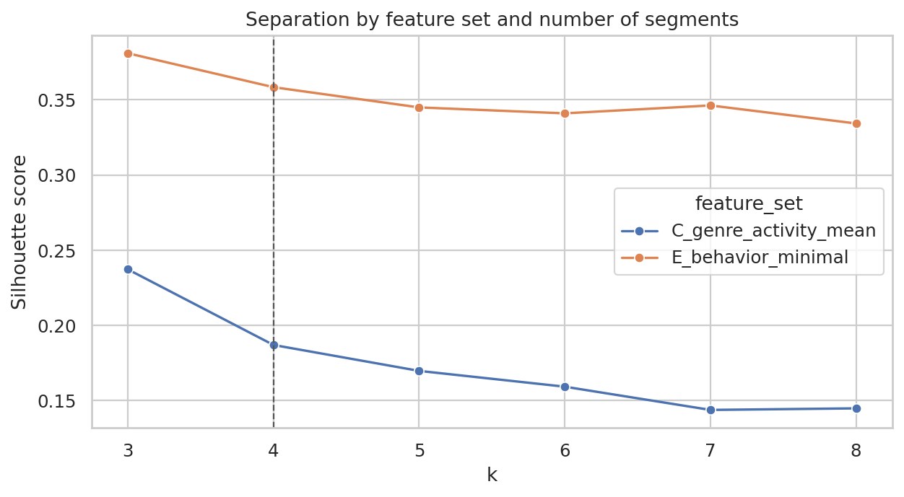
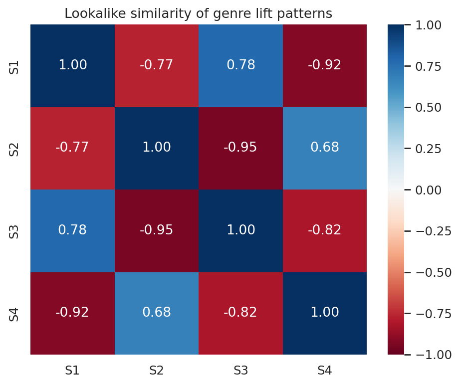

# Methodology

## Analytical objective

Group users into stable, interpretable behavioral audiences, then use genre-level behavior as an explanatory layer for content and marketing hypotheses.

## 1. Data preparation

- `u.data` is treated as the canonical ratings table.
- All 943 users are retained; unusual users are flagged rather than automatically removed.
- Demographics are excluded from clustering and used only as descriptive context.
- Multi-genre movies use fractional weighting so one rating contributes a total genre weight of 1.

## 2. Feature design

The final clustering model intentionally uses only two standardized behavioral features:

1. `log(1 + rating_count)` - activity intensity
2. mean user rating - rating disposition

Broader feature sets including rating variability and genre shares were tested, but they reduced cluster separation. Genre behavior is therefore used after clustering, where it is easier to interpret without circularity.

## 3. Model selection

K-means was used because the inputs are standardized numeric features and centroid assignment is simple to operationalize for new users.

The project tested:

- K = 3 through 8
- five declared feature sets
- all users vs. an outlier-excluded sensitivity population
- 60 core configurations

K=3 had the stronger silhouette (0.381 vs. 0.358), while K=4 had very strong whole-user fold stability (reference ARI about 0.95) and separated high-activity users into critical vs. positive rating styles. The final K=4 fit uses 50 initializations to reduce seed sensitivity.

## 4. Validation

Validation holds out complete users rather than individual ratings because the question is whether the learned segment structure transfers to unseen users.

- 2 repetitions of 10-fold whole-user validation
- activity-quintile balancing
- silhouette, Calinski-Harabasz, Davies-Bouldin
- Adjusted Rand Index for stability
- held-out distance and assignment margin
- minimum cluster-size checks

## 5. Genre affinity

Genre affinity is deliberately multidimensional rather than collapsed into one score:

- **Engagement share** - how much of an audience's rating activity a genre receives
- **Engagement lift** - segment share relative to population share
- **Centered preference** - how a user rates a genre relative to their own average
- **Support** - share of users in the segment with activity in the genre

This prevents a small niche genre with a large relative lift from being mistaken for a large-scale opportunity.

## 6. Lookalike analysis

Cosine similarity is calculated across genre-profile deviations to identify audience pairs with similar content patterns. Similarity is descriptive: it does not imply interchangeable users or proven campaign transfer.

## 7. Interpretation guardrails

- Ratings are treated as a proxy for engagement, not verified viewing.
- Segment labels describe measured behavior, not motivation or identity.
- Assignment margin is not a probability.
- Recommendations are hypotheses to test, not causal claims.
